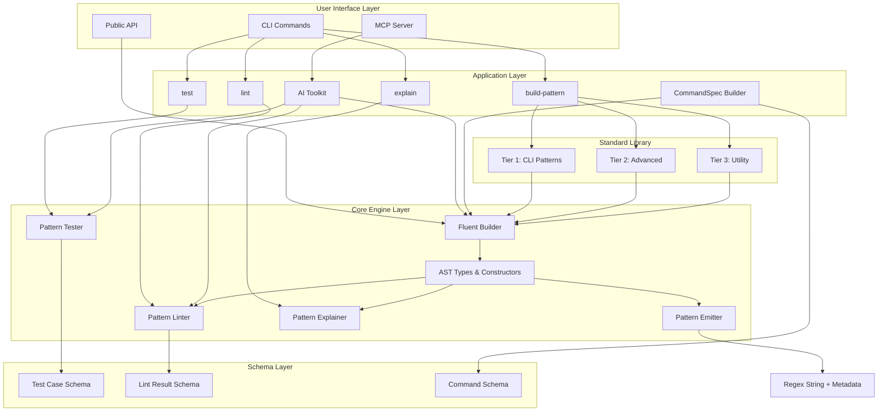

# System Architecture: effect-regex

## 1. Overview

effect-regex follows a layered architecture with clear separation of concerns, built on Effect's functional programming principles. The system transforms high-level pattern specifications into validated, dialect-aware regex strings through a deterministic AST-based pipeline.

## 2. Architecture Diagram



## 3. Component Breakdown

### 3.1 User Interface Layer

#### CLI (src/Cli.ts, src/bin.ts)
**Purpose**: Primary command-line interface for end users

**Responsibilities**:
- Parse command-line arguments using @effect/cli
- Route to appropriate application commands
- Format and output JSON results
- Handle errors and provide user feedback

**Key Patterns**:
- Command.make for declarative command definitions
- Effect.gen for composition
- Console.log/error for output

**Dependencies**: @effect/cli, Application Layer commands

#### MCP Server (src/mcp/server.ts)
**Purpose**: Model Context Protocol integration for AI assistants

**Responsibilities**:
- Expose regex tools via MCP protocol
- Handle tool invocations from AI clients
- Manage server lifecycle
- Validate tool inputs/outputs

**Dependencies**: @modelcontextprotocol/sdk, Core Engine Layer

#### Public API (exported from modules)
**Purpose**: Programmatic access to all functionality

**Responsibilities**:
- Export core builder API
- Export standard library patterns
- Export testing/linting utilities
- Maintain type safety and documentation

### 3.2 Application Layer

#### build-pattern Command
**Purpose**: Generate patterns from standard library

**Flow**:
1. Accept pattern name as argument
2. Lookup in STANDARD_PATTERNS registry
3. Emit pattern with specified dialect
4. Return pattern + notes + capture map

**Error Handling**:
- Unknown pattern name → error message + available patterns list
- Emission errors → propagated through Effect

#### lint Command
**Purpose**: Validate regex patterns

**Flow**:
1. Accept raw regex string
2. Create RegExp to test basic validity
3. Optionally: parse to AST for deep linting
4. Return structured lint result (valid, issues array)

**Error Handling**:
- Invalid syntax → caught and returned as lint issue
- Dialect incompatibilities → warnings

#### explain Command
**Purpose**: Analyze and explain regex structure

**Flow**:
1. Accept regex string
2. Parse/analyze structure
3. Generate human-readable explanation
4. Return explanation + metadata

**Status**: Skeleton implemented, needs enhancement

#### test Command
**Purpose**: Run test cases against patterns

**Flow**:
1. Accept pattern string + test cases file
2. Parse test cases from JSON
3. Execute tests with timeout protection
4. Return test results (passed, failed, warnings)

**Error Handling**:
- Timeout → captured as warning
- Match failures → detailed failure info

#### AI Toolkit (src/ai/toolkit.ts)
**Purpose**: Automated pattern development loop

**Responsibilities**:
- Propose initial patterns from examples
- Test patterns against cases
- Analyze failures and suggest refinements
- Iterate until success or max iterations

**Key Functions**:
- `proposePattern`: Generate initial pattern from examples
- `testPattern`: Execute test suite
- `analyzeAndRefine`: Suggest improvements
- `developPattern`: Full propose → test → refine loop

**Integration Points**: Builder, Tester, Linter

#### CommandSpec Builder (src/command/command-spec.ts)
**Purpose**: Generate regexes from CLI specifications

**Responsibilities**:
- Parse command syntax definitions
- Build regex matching command structure
- Generate semantic capture maps
- Support flags, options, arguments

**Use Case**: CLI parsers need to extract structured data from command invocations

### 3.3 Core Engine Layer

#### AST (src/core/ast.ts)
**Purpose**: Abstract Syntax Tree representation of regex patterns

**Node Types**:
- `LitNode`: Literal text (auto-escaped)
- `RawNode`: Raw regex patterns (unescaped)
- `SeqNode`: Sequential composition
- `AltNode`: Alternation (sorted for determinism)
- `CharClassNode`: Character classes [a-z]
- `GroupNode`: Capturing groups (?<name>...)
- `NonCapNode`: Non-capturing groups (?:...)
- `QuantifierNode`: Repetition {n,m}, *, +, ?
- `AnchorNode`: Position anchors ^, $, \b

**Key Properties**:
- Immutable data structures
- Deterministic ordering (alternations sorted)
- Type-safe construction

**Constructor Functions**:
```typescript
lit(value: string): LitNode
raw(pattern: string): RawNode
seq(...children: AstNode[]): SeqNode
alt(...children: AstNode[]): AltNode
cls(chars: string, negated?: boolean): CharClassNode
group(child: AstNode, name?: string): GroupNode
q(child: AstNode, min: number, max: number | null, lazy?: boolean): QuantifierNode
anchor(position: "start" | "end" | "word"): AnchorNode
```

#### Fluent Builder (src/core/builder.ts)
**Purpose**: Chainable API for building patterns

**Design**: Wrapper around AST with fluent methods

**Key Methods**:
- **Construction**: `lit()`, `raw()`, `charClass()`, `digit()`, `word()`, `whitespace()`, `any()`
- **Composition**: `then()`, `or()`, `alt(...)`
- **Grouping**: `group()`, `capture(name?)`
- **Quantifiers**: `zeroOrMore()`, `oneOrMore()`, `optional()`, `exactly(n)`, `atLeast(n)`, `between(min, max)`
- **Anchors**: `startOfLine()`, `endOfLine()`, `wordBoundary()`
- **Utilities**: `getAst()`, `clone()`

**Pattern**:
```typescript
const pattern = RegexBuilder
  .lit("hello")
  .then(RegexBuilder.whitespace().oneOrMore())
  .then(RegexBuilder.word().oneOrMore())
  .capture("greeting");
```

**Returns**: New RegexBuilder instance (immutable pattern)

#### Emitter (src/core/emitter.ts)
**Purpose**: Convert AST to regex strings with dialect support

**Responsibilities**:
- Walk AST and generate regex syntax
- Apply dialect-specific transformations
- Generate capture maps (name → index)
- Collect warnings and notes
- Ensure deterministic output

**Dialect Handling**:
- **JS**: Full feature support
- **RE2**: Gate backreferences, lookbehind, atomic groups
- **PCRE**: Minimal transformations (mostly compatible with JS)

**Output**:
```typescript
interface RegexPattern {
  pattern: string;              // Emitted regex
  ast: Ast;                     // Original AST
  notes: readonly string[];     // Warnings/info
  captureMap?: Record<string, number | number[]>;  // Named groups
}
```

#### Linter (src/core/linter.ts)
**Purpose**: Validate patterns and detect issues

**Checks**:
- Syntax validity (via RegExp constructor)
- Dialect compatibility (check AST for gated features)
- Performance issues (nested quantifiers, backtracking)
- Best practices (prefer non-capturing groups, etc.)

**Output**:
```typescript
interface LintResult {
  valid: boolean;
  issues: readonly {
    code: string;
    severity: "error" | "warning" | "info";
    message: string;
  }[];
}
```

#### Tester (src/core/tester.ts)
**Purpose**: Execute test cases with timeout protection

**Features**:
- Positive/negative test cases
- Timeout protection (default 100ms)
- Dialect simulation (re2-sim, re2, js)
- Detailed failure reporting

**Test Case Schema**:
```typescript
interface RegexTestCase {
  input: string;
  shouldMatch: boolean;
  expectedCaptures?: Record<string, string>;
  description?: string;
}
```

**Result**:
```typescript
interface TestResult {
  passed: number;
  failed: number;
  warnings: readonly string[];
  failures: readonly {
    caseIndex: number;
    matched: boolean;
    expected: boolean;
    timedOut?: boolean;
  }[];
}
```

#### Explainer (src/core/explainer.ts)
**Purpose**: Generate human-readable explanations

**Status**: Basic implementation

**Future Enhancement**:
- Break down pattern into components
- Explain quantifier behavior
- Highlight potential edge cases
- Suggest simplifications

### 3.4 Standard Library (src/std/patterns.ts)

**Organization**: 3-tier pattern library

**Tier 1 - CLI Focused**:
- `quotedString`: Single/double quoted strings
- `keyValue`: key=value pairs (CLI args)
- `pathSegment`: Directory/file names
- `filePathBasic`: Unix/Windows paths
- `csvList`: Comma-separated values
- `integer`: Signed integers

**Tier 2 - Advanced**:
- `uuidV4`: UUID version 4 format
- `semverStrict`: Semantic versioning

**Tier 3 - Utility**:
- `ipv4`: IPv4 addresses
- `ipv6Compressed`: IPv6 with compression
- `float`: Floating point numbers
- `isoDate`: ISO 8601 dates (YYYY-MM-DD)
- `isoDateTime`: ISO 8601 timestamps

**Pattern Registry**:
```typescript
export const STANDARD_PATTERNS = {
  [name]: {
    pattern: RegexBuilder;
    description: string;
    examples: string[];
    dialect: "universal" | "js" | "re2" | "pcre";
  }
}
```

### 3.5 Schema Layer (src/schemas/*)

**Purpose**: Type-safe data validation and serialization

**Schemas**:
- `TestCaseSchema`: Validate test case JSON
- `LintResultSchema`: Serialize lint results
- `CommandSchema`: Parse command specifications
- `PatternMetadataSchema`: Standard library metadata

**Technology**: Effect Schema for runtime validation

## 4. Data Flow

### 4.1 Pattern Building Flow
```
User Code → RegexBuilder methods → AST construction → emit() → Regex String
                                                              ↓
                                                        Capture Map
                                                        Notes/Warnings
```

### 4.2 Standard Library Pattern Flow
```
CLI "build-pattern quotedString"
  → BuildCmd
  → STANDARD_PATTERNS lookup
  → emit(pattern, dialect)
  → JSON output
```

### 4.3 Testing Flow
```
Pattern + Test Cases
  → testRegex()
  → Execute each case (with timeout)
  → Compare actual vs expected
  → TestResult
```

### 4.4 AI Development Flow
```
Examples → proposePattern → testPattern → analyzeAndRefine → iterate → Final Pattern
```

## 5. Design Principles

### 5.1 Determinism
- AST alternations sorted lexicographically
- Same AST always emits same regex
- No random or time-based behavior
- Enables reliable testing and caching

### 5.2 Immutability
- All AST nodes are readonly
- Builder methods return new instances
- No shared mutable state
- Thread-safe by design

### 5.3 Type Safety
- Full TypeScript coverage
- Effect types for error handling
- Schema validation for external data
- Compile-time guarantees where possible

### 5.4 Composability
- Small, focused functions
- Builder API for composition
- Standard library patterns reuse primitives
- Effect composition with pipe/gen

### 5.5 Testability
- Pure functions throughout
- Dependency injection via Effect context
- Test helpers and fixtures
- Comprehensive corpora

## 6. Extension Points

### 6.1 Adding Standard Library Patterns
1. Create pattern using RegexBuilder
2. Add to STANDARD_PATTERNS registry
3. Include description and examples
4. Add test corpus in test/corpora/

### 6.2 Adding Dialects
1. Define dialect in Emitter
2. Add gating logic for incompatible features
3. Update Linter validation
4. Add dialect-specific tests

### 6.3 Custom Commands
1. Use Command.make from @effect/cli
2. Implement Effect-based handler
3. Add to Cli.ts subcommands array
4. Export from bin.ts

### 6.4 MCP Tools
1. Define tool schema
2. Implement tool handler
3. Register in MCP server
4. Add tool documentation

## 7. Error Handling Strategy

### 7.1 Effect Error Model
- Use Effect<Success, Error, Requirements> throughout
- Specific error types per layer
- Combine errors with Effect.catchAll
- Propagate errors to CLI/API boundary

### 7.2 User Errors vs System Errors
- **User Errors**: Invalid input, unknown pattern, bad syntax
  - Return as structured results (lint issues, etc.)
  - Don't throw exceptions
- **System Errors**: File I/O, network, unexpected failures
  - Use Effect error channel
  - Provide recovery mechanisms

## 8. Performance Considerations

### 8.1 Optimization Strategies
- AST construction is cheap (just object creation)
- Emission is deterministic (can cache results)
- Testing uses timeout protection
- RE2 dialect for production safety

### 8.2 Bottlenecks
- Complex pattern emission: O(n) where n = AST nodes
- Testing: O(m × k) where m = test cases, k = input length
- AI iteration: Multiple test rounds

## 9. Security Considerations

### 9.1 ReDoS Protection
- Timeout protection in tester (default 100ms)
- Recommend RE2 dialect for untrusted input
- Lint warnings for nested quantifiers
- Test against attack patterns

### 9.2 Input Validation
- Schema validation for JSON inputs
- Escape user-provided literals
- Sanitize raw patterns
- Limit recursion depth in AST

## 10. Future Architecture Enhancements

### 10.1 Planned M3 Features
- MCP server deployment
- Pattern optimization engine
- Interactive debugger
- Visual AST viewer
- Documentation generator

### 10.2 Scalability Concerns
- Caching layer for emitted patterns
- Parallel test execution
- Incremental linting
- Background pattern analysis
