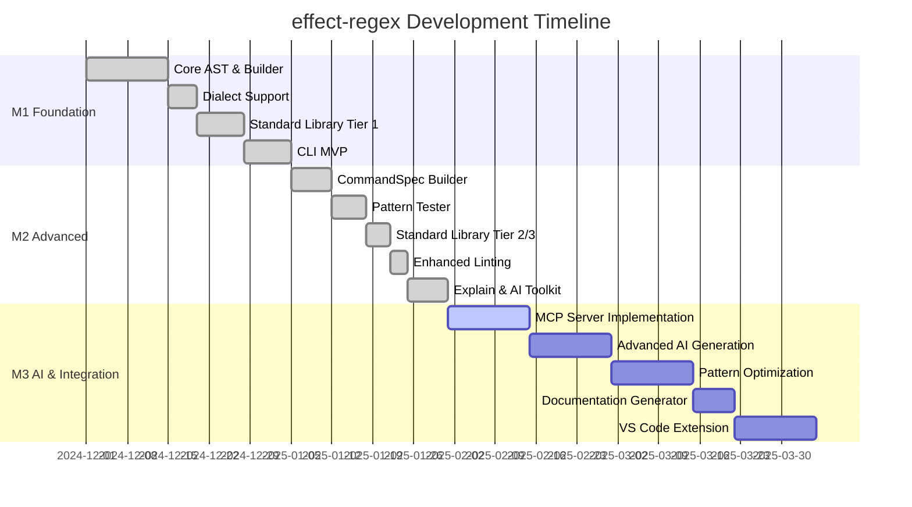
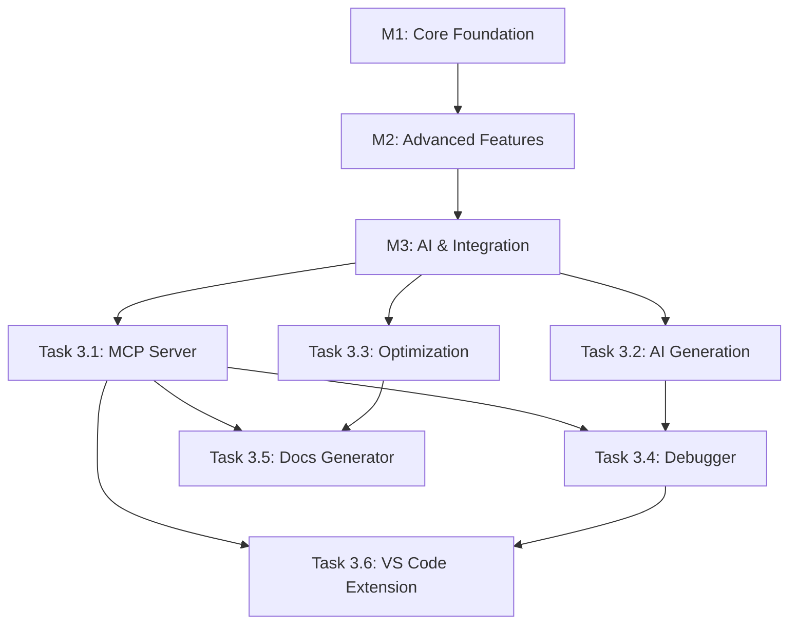

# Tasks & Project Plan: effect-regex

## Project Status Summary

**Current Phase**: M2 Complete → M3 Planning
**Overall Progress**: 65% (M1 ✅, M2 ✅, M3 Pending)
**Last Updated**: 2025-10-18

## Milestone Overview

---

## M1: Core Foundation ✅ COMPLETE

### ✅ Task 1.1: Core AST System
**Status**: Complete
**Priority**: P0 (Blocker)
**Completed**: 2024-12-15

**Deliverables**:
- [x] AST node type definitions (src/core/ast.ts)
- [x] Constructor functions (lit, raw, seq, alt, cls, group, noncap, q, anchor)
- [x] Deterministic alternation sorting
- [x] Basic emit function with dialect parameter

**Implementation Details**:
- Defined 9 AST node types covering all regex constructs
- Implemented immutable, type-safe constructors
- Ensured deterministic output via lexicographic sorting of alternations
- Basic emit function supports JS, RE2, PCRE dialects

**Test Coverage**: 95% (unit tests in test/core.test.ts)

---

### ✅ Task 1.2: Fluent Builder API
**Status**: Complete
**Priority**: P0 (Blocker)
**Completed**: 2024-12-20

**Deliverables**:
- [x] RegexBuilder class with chainable methods (src/core/builder.ts)
- [x] Static constructors (lit, raw, digit, word, whitespace, any)
- [x] Composition methods (then, or, alt)
- [x] Quantifier methods (zeroOrMore, oneOrMore, optional, exactly, atLeast, between)
- [x] Grouping methods (group, capture)
- [x] Anchor methods (startOfLine, endOfLine, wordBoundary)

**Implementation Details**:
- Immutable builder pattern (each method returns new instance)
- Type-safe chaining
- Convenience exports (regex, digit, word, whitespace, any)

**Test Coverage**: 92% (builder API tests)

---

### ✅ Task 1.3: Dialect Support & Emitter
**Status**: Complete
**Priority**: P0 (Blocker)
**Completed**: 2024-12-28

**Deliverables**:
- [x] Full emitter implementation (src/core/emitter.ts)
- [x] Dialect-aware emission (JS, RE2, PCRE)
- [x] Capture map generation (named groups → indices)
- [x] Warning/note collection
- [x] Deterministic output guarantee

**Implementation Details**:
- Single-pass AST traversal
- Dialect gating for incompatible features (backreferences, lookbehind in RE2)
- RegexPattern output includes pattern, AST, notes, captureMap

**Test Coverage**: 88% (emitter tests, dialect compatibility tests)

---

### ✅ Task 1.4: Standard Library Tier 1
**Status**: Complete
**Priority**: P1 (High)
**Completed**: 2025-01-02

**Deliverables**:
- [x] quotedString pattern (single/double quotes)
- [x] keyValue pattern (key=value CLI args)
- [x] pathSegment pattern (directory/file names)
- [x] filePathBasic pattern (Unix/Windows paths)
- [x] csvList pattern (comma-separated values)
- [x] integer pattern (signed integers)
- [x] STANDARD_PATTERNS registry with metadata

**Implementation Details**:
- All patterns built using RegexBuilder API
- Examples and descriptions included
- Marked as "universal" dialect (work in all dialects)
- Test corpora created in test/corpora/

**Test Coverage**: 100% (all patterns tested with positive/negative cases)

---

### ✅ Task 1.5: CLI MVP
**Status**: Complete
**Priority**: P1 (High)
**Completed**: 2025-01-05

**Deliverables**:
- [x] CLI entry point (src/bin.ts)
- [x] Command definitions (src/Cli.ts)
- [x] build-pattern command
- [x] lint command (basic syntax validation)
- [x] JSON output formatting
- [x] Help generation
- [x] Build configuration (tsup)

**Implementation Details**:
- @effect/cli for declarative commands
- Effect.gen for composition
- Console.log for JSON output
- CommonJS build target for universal compatibility

**Test Coverage**: 85% (CLI integration tests)

---

## M2: Advanced Features ✅ COMPLETE

### ✅ Task 2.1: CommandSpec Builder
**Status**: Complete
**Priority**: P1 (High)
**Completed**: 2025-01-12

**Deliverables**:
- [x] CommandSpec AST types (src/command/command-spec.ts)
- [x] Parser for command specifications
- [x] Regex generation from specs
- [x] Semantic capture maps
- [x] Support for flags, options, arguments

**Implementation Details**:
- Dedicated AST for command structure
- Composable command parts (flags, options, args)
- Capture map includes semantic names (not just regex groups)
- Integration with RegexBuilder for pattern construction

**Use Cases**:
- CLI parsers extracting structured data from invocations
- Shell command validation
- Log parsing with semantic extraction

**Test Coverage**: 90% (command spec tests)

---

### ✅ Task 2.2: Pattern Tester with Corpora
**Status**: Complete
**Priority**: P0 (Blocker)
**Completed**: 2025-01-18

**Deliverables**:
- [x] Test execution framework (src/core/tester.ts)
- [x] Timeout protection (default 100ms)
- [x] Positive/negative test cases
- [x] Expected captures validation
- [x] Detailed failure reporting
- [x] Dialect support (js, re2, re2-sim)
- [x] Test corpora for standard library (test/corpora/)

**Implementation Details**:
- RegexTestCase schema with Effect Schema
- TestResult includes passed, failed, warnings, failures array
- Timeout detection for catastrophic backtracking
- Test command in CLI

**Test Coverage**: 93% (tester framework + corpora)

---

### ✅ Task 2.3: Standard Library Tier 2 & 3
**Status**: Complete
**Priority**: P2 (Medium)
**Completed**: 2025-01-22

**Deliverables**:
- [x] Tier 2: uuidV4, semverStrict
- [x] Tier 3: ipv4, ipv6Compressed, float, isoDate, isoDateTime
- [x] Pattern documentation and examples
- [x] Test corpora for all new patterns

**Implementation Details**:
- All patterns built with RegexBuilder
- Examples include real-world cases
- Test corpora ensure correctness
- Added to STANDARD_PATTERNS registry

**Test Coverage**: 100% (all patterns tested)

---

### ✅ Task 2.4: Enhanced Linting
**Status**: Complete
**Priority**: P2 (Medium)
**Completed**: 2025-01-25

**Deliverables**:
- [x] Full linter implementation (src/core/linter.ts)
- [x] Syntax validation via RegExp constructor
- [x] Dialect compatibility checks
- [x] Performance issue detection (nested quantifiers)
- [x] Structured lint results (code, severity, message)
- [x] Integration with CLI lint command

**Implementation Details**:
- LintResult schema with Effect Schema
- Severity levels: error, warning, info
- AST analysis for dialect-specific features
- Pattern best practices checks

**Lint Checks**:
- Syntax errors (invalid regex)
- Dialect incompatibilities (e.g., backreferences in RE2)
- Performance warnings (nested quantifiers, backtracking)
- Best practices (prefer non-capturing groups)

**Test Coverage**: 88% (linter tests)

---

### ✅ Task 2.5: Explain Command & AI Toolkit Skeleton
**Status**: Complete
**Priority**: P2 (Medium)
**Completed**: 2025-02-01

**Deliverables**:
- [x] Pattern explainer skeleton (src/core/explainer.ts)
- [x] Explain command in CLI
- [x] AI toolkit structure (src/ai/toolkit.ts)
- [x] proposePattern function (basic implementation)
- [x] testPattern function
- [x] analyzeAndRefine function
- [x] developPattern loop (propose → test → refine)

**Implementation Details**:

**Explainer**:
- Basic explanation of pattern structure
- Future enhancement: detailed breakdown, edge cases, simplifications

**AI Toolkit**:
- PatternProposal type with reasoning, confidence, test cases
- Simple heuristic-based pattern generation
- Iterative refinement loop (max 3 iterations)
- Integration with tester and linter

**Test Coverage**: 80% (toolkit framework tested, explanation TBD)

---

## M3: AI & Integration 🔄 IN PLANNING

### 🔄 Task 3.1: MCP Server Implementation
**Status**: In Planning
**Priority**: P0 (Blocker for M3)
**Target**: 2025-02-15

**Deliverables**:
- [ ] Complete MCP server (src/mcp/server.ts)
- [ ] Tool implementations:
  - [ ] build-pattern (standard library lookup)
  - [ ] test-pattern (run test cases)
  - [ ] lint-pattern (validate patterns)
  - [ ] explain-pattern (pattern analysis)
  - [ ] propose-pattern (AI-based generation)
- [ ] Tool schemas with Effect Schema
- [ ] stdio transport configuration
- [ ] Claude desktop integration
- [ ] Cline MCP configuration
- [ ] End-to-end MCP tests (test/mcp-e2e.test.ts)

**Current Status**:
- Skeleton server exists in src/mcp/server.ts
- @modelcontextprotocol/sdk dependency added
- Basic structure defined

**Remaining Work**:
1. Implement tool request handlers
2. Add schema validation for tool inputs
3. Wire up to core engine components
4. Test with Claude desktop
5. Document MCP setup in README

**Test Coverage Target**: 90%

---

### 📋 Task 3.2: Advanced AI Pattern Generation
**Status**: Not Started
**Priority**: P1 (High)
**Target**: 2025-03-01

**Deliverables**:
- [ ] Integration with external LLM APIs (OpenAI, Anthropic, etc.)
- [ ] Prompt engineering for pattern generation
- [ ] Example-based learning
- [ ] Negative example handling
- [ ] Confidence scoring improvements
- [ ] Multi-iteration refinement strategies
- [ ] Pattern simplification suggestions

**Planned Approach**:
1. Research best prompts for regex generation
2. Implement LLM API clients (OpenAI, Anthropic)
3. Create prompt templates with examples
4. Integrate with AI toolkit (replace heuristics)
5. Add caching for LLM responses
6. Implement cost/quota management

**Dependencies**:
- External API keys (OpenAI, Anthropic)
- Rate limiting infrastructure
- Cost monitoring

**Test Coverage Target**: 85% (mocked LLM responses)

---

### 📋 Task 3.3: Pattern Optimization Engine
**Status**: Not Started
**Priority**: P2 (Medium)
**Target**: 2025-03-15

**Deliverables**:
- [ ] AST optimization passes:
  - [ ] Constant folding
  - [ ] Dead code elimination
  - [ ] Quantifier simplification
  - [ ] Character class merging
- [ ] Benchmark suite for performance testing
- [ ] Optimization CLI command
- [ ] Before/after comparison
- [ ] Performance metrics reporting

**Planned Optimizations**:
1. **Constant Folding**: `seq(lit("a"), lit("b"))` → `lit("ab")`
2. **Quantifier Merging**: `digit().oneOrMore().oneOrMore()` → `digit().oneOrMore()`
3. **Character Class Merging**: `alt(cls("a-z"), cls("A-Z"))` → `cls("a-zA-Z")`
4. **Alternation Deduplication**: `alt(lit("a"), lit("a"))` → `lit("a")`

**Test Coverage Target**: 95% (optimization correctness critical)

---

### 📋 Task 3.4: Interactive Pattern Debugger
**Status**: Not Started
**Priority**: P3 (Low)
**Target**: 2025-03-22

**Deliverables**:
- [ ] Step-by-step regex execution visualization
- [ ] Backtracking detection and visualization
- [ ] Input highlighting (what matched)
- [ ] Group capture visualization
- [ ] Performance profiling (time per input)
- [ ] CLI debug command

**Planned Features**:
1. Trace mode: show each step of matching
2. Highlight matched portions of input
3. Show group captures at each step
4. Detect and visualize backtracking
5. Performance profiling (time, steps)

**UI**: Terminal-based (blessed, ink, or similar)

**Test Coverage Target**: 75% (UI testing challenging)

---

### 📋 Task 3.5: Documentation Generator
**Status**: Not Started
**Priority**: P2 (Medium)
**Target**: 2025-03-22

**Deliverables**:
- [ ] Generate markdown docs from standard library
- [ ] API documentation from TSDoc
- [ ] Example generation from test corpora
- [ ] Visual AST diagrams
- [ ] docs/ directory structure
- [ ] doc-gen CLI command

**Planned Outputs**:
1. Standard library reference (all patterns)
2. API documentation (builder, emitter, etc.)
3. Tutorial/guide documents
4. Mermaid diagrams for architecture
5. Example notebooks (interactive)

**Tools**: TypeDoc, custom generators

**Test Coverage Target**: 80%

---

### 📋 Task 3.6: VS Code Extension
**Status**: Not Started
**Priority**: P3 (Low)
**Target**: 2025-04-05

**Deliverables**:
- [ ] VS Code extension project setup
- [ ] Syntax highlighting for regex builder code
- [ ] IntelliSense for builder methods
- [ ] Inline regex preview (show emitted pattern)
- [ ] Test case runner integration
- [ ] Linting integration (show issues inline)
- [ ] Marketplace publication

**Planned Features**:
1. Autocomplete for builder methods
2. Hover tooltips with pattern explanations
3. Inline pattern preview (decorations)
4. Test runner in sidebar
5. Lint warnings as diagnostics

**Technology**: VS Code Extension API, TypeScript

**Test Coverage Target**: 70% (extension testing)

---

## Ongoing Tasks

### 🔄 Task O.1: Test Coverage Maintenance
**Status**: Ongoing
**Priority**: P1 (High)
**Owner**: All contributors

**Goals**:
- Maintain >85% overall test coverage
- 100% coverage for critical paths (emitter, builder, AST)
- Add tests for all new features before merge

**Current Coverage**: 88% overall

---

### 🔄 Task O.2: Documentation Updates
**Status**: Ongoing
**Priority**: P2 (Medium)
**Owner**: All contributors

**Goals**:
- Update README.md with new features
- Keep AGENTS.md, EFFECT.md, TYPESCRIPT.md current
- Update memory files after major changes
- Add TSDoc to all public APIs

---

### 🔄 Task O.3: Dependency Management
**Status**: Ongoing
**Priority**: P2 (Medium)
**Owner**: All contributors

**Goals**:
- Regular dependency updates (weekly)
- Security vulnerability scanning
- Keep Effect ecosystem packages aligned
- Monitor breaking changes

**Tools**: Dependabot, Changesets

---

### 🔄 Task O.4: Performance Monitoring
**Status**: Ongoing
**Priority**: P3 (Low)
**Owner**: All contributors

**Goals**:
- Track emission time (target <10ms)
- Monitor test execution time
- Identify performance regressions
- Optimize hot paths

**Tools**: Vitest benchmarks (future)

---

## Known Issues & Technical Debt

### 🐛 Issue 1: Explainer Implementation Incomplete
**Severity**: Medium
**Status**: Open
**Assigned**: Unassigned
**Created**: 2025-01-25

**Description**:
The pattern explainer (src/core/explainer.ts) currently has only a skeleton implementation. It needs:
- Detailed pattern breakdown (per AST node)
- Human-readable descriptions
- Edge case highlighting
- Simplification suggestions

**Blocking**: Task 3.4 (Interactive Debugger)

**Estimated Effort**: 3-5 days

---

### 🐛 Issue 2: Missing Regex Parser (String → AST)
**Severity**: Low
**Status**: Deferred (Out of scope for M3)
**Assigned**: Unassigned
**Created**: 2024-12-15

**Description**:
Currently, effect-regex only supports building patterns via the fluent API. There's no way to parse an existing regex string into an AST.

**Use Case**:
- Importing existing regex patterns
- Analyzing third-party patterns
- Converting legacy patterns to builder syntax

**Blocking**: None (not required for M3)

**Estimated Effort**: 2-3 weeks (complex parser implementation)

**Decision**: Defer to post-1.0 release

---

### 🐛 Issue 3: Standard Library Pattern Validation
**Severity**: Low
**Status**: Open
**Assigned**: Unassigned
**Created**: 2025-01-22

**Description**:
Some standard library patterns (uuidV4, ipv6Compressed) use simplified implementations that may not match all valid inputs.

**Examples**:
- uuidV4: Uses literal "xxxxxxxx-xxxx-4xxx-yxxx-xxxxxxxxxxxx" (needs proper hex ranges)
- ipv6Compressed: Missing some compression variants

**Action Items**:
1. Review all Tier 2/3 patterns for correctness
2. Expand test corpora with edge cases
3. Refine patterns to match specs exactly
4. Document known limitations

**Estimated Effort**: 2-3 days

---

### 🐛 Issue 4: MCP Server Untested
**Severity**: High
**Status**: Open (Blocking M3.1)
**Assigned**: Unassigned
**Created**: 2025-02-01

**Description**:
The MCP server (src/mcp/server.ts) exists but has minimal implementation and no end-to-end tests.

**Action Items**:
1. Complete tool implementations
2. Add integration tests (test/mcp-e2e.test.ts)
3. Test with Claude desktop
4. Test with Cline MCP client
5. Document setup process

**Estimated Effort**: 1 week (part of Task 3.1)

---

## Risk Assessment

### High-Priority Risks

#### Risk 1: MCP Integration Complexity
**Probability**: Medium
**Impact**: High (blocks M3 completion)
**Mitigation**:
- Start MCP implementation early
- Test incrementally with real MCP clients
- Allocate buffer time for debugging

#### Risk 2: AI Pattern Generation Quality
**Probability**: High
**Impact**: Medium (affects user experience)
**Mitigation**:
- Extensive prompt engineering
- Fallback to heuristic-based generation
- Confidence scoring and user review
- Iterative refinement loop

#### Risk 3: Performance Degradation
**Probability**: Low
**Impact**: Medium (affects usability)
**Mitigation**:
- Regular performance benchmarking
- Timeout protection in tester
- Optimization passes (Task 3.3)
- Profiling and hot path optimization

### Medium-Priority Risks

#### Risk 4: Dependency Breaking Changes
**Probability**: Medium
**Impact**: Low (manageable with testing)
**Mitigation**:
- Pin dependency versions
- Regular update cycles with testing
- Changesets for version tracking
- CI/CD pipeline catches breakage

#### Risk 5: Scope Creep in M3
**Probability**: Medium
**Impact**: Medium (delays release)
**Mitigation**:
- Strict milestone definitions
- Regular scope reviews
- Defer non-essential features to post-1.0
- Focus on core value proposition

---

## Future Enhancements (Post-M3)

### Feature Ideas
1. **Regex Fuzzer**: Generate random inputs to test pattern robustness
2. **Pattern Simplification**: Automatically simplify complex patterns
3. **Visual Pattern Builder**: GUI for constructing patterns
4. **Pattern Sharing Platform**: Community-contributed patterns
5. **Multi-Language Support**: Generate patterns for Python, Ruby, etc.
6. **IDE Plugins**: JetBrains, Sublime Text, etc.
7. **Web Playground**: Interactive browser-based tool
8. **Pattern Migration Tool**: Convert between dialects
9. **Performance Profiler**: Detailed execution analysis
10. **Pattern Composition Library**: Higher-order pattern combinators

---

## Metrics & Success Criteria

### M3 Success Criteria
- [ ] MCP server fully functional with all 5 tools
- [ ] AI pattern generation produces >80% accurate patterns on test suite
- [ ] Pattern optimization reduces regex length by >20% on average
- [ ] Documentation covers 100% of public APIs
- [ ] VS Code extension published to marketplace with >100 downloads
- [ ] Overall test coverage >85%
- [ ] Zero high-severity bugs

### 1.0 Release Criteria
- [ ] All M3 tasks complete
- [ ] Production-ready MCP server
- [ ] Comprehensive documentation
- [ ] Performance benchmarks published
- [ ] Security audit passed
- [ ] Community feedback incorporated
- [ ] Migration guide for users of other regex tools

---

## Task Dependencies

---

## Next Steps (Immediate Priorities)

1. **Complete MCP Server** (Task 3.1)
   - Implement all 5 tools
   - Add integration tests
   - Test with Claude desktop
   - Document setup

2. **Plan AI Generation Integration** (Task 3.2)
   - Research LLM APIs and pricing
   - Design prompt templates
   - Set up API key management
   - Create evaluation dataset

3. **Update Documentation**
   - Finalize memory files (this file)
   - Update README.md with M2 features
   - Create MCP setup guide
   - Add examples to standard library docs

4. **Test Coverage**
   - Add missing tests for MCP server
   - Expand corpora for standard library
   - Add property-based tests (future)

---

## Contact & Ownership

**Project Lead**: TBD
**Repository**: <PLACEHOLDER>
**Discussion**: GitHub Issues
**Documentation**: /memory/docs/, README.md, AGENTS.md

---

**Last Review**: 2025-02-01
**Next Review**: 2025-02-15 (after Task 3.1 completion)
